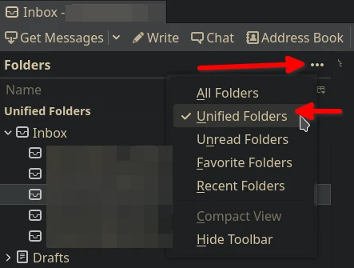
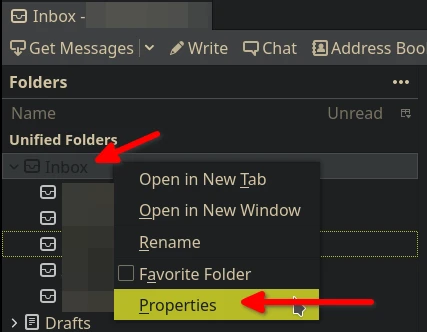
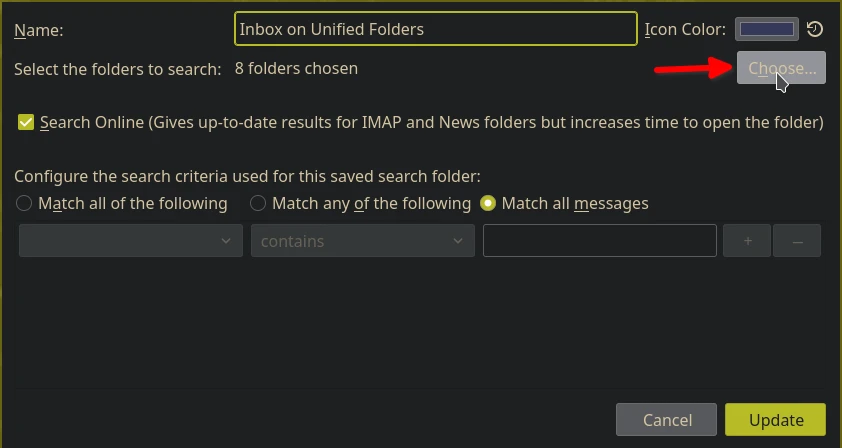
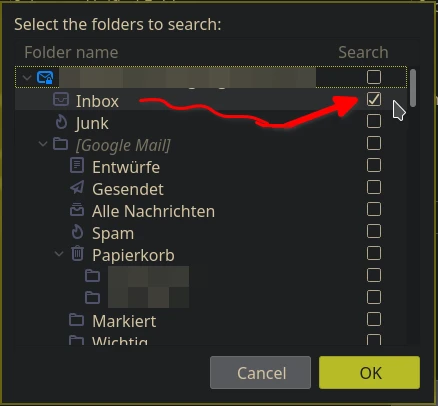
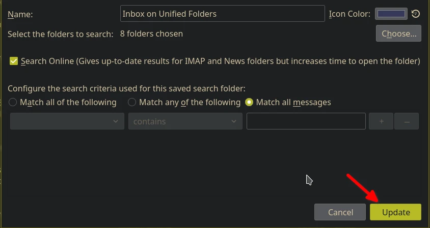

# SmartBird

A Qtile widget to display new mails on Unified Folders from a Thunderbird profile.

## Description

This widget is a plugin for Qtile, that will display the number of new unread
mails on the bar. It will lookup in your Thunderbird profile, with the "Unified
Folders" enabled and mail accounts or feeds already setup. The "Unified
Folders" are saved on the disk under the directory "smart mailboxes". That's
where the name of the widget come from.

### Why a new email widget?

Despite that a few email related widgets exist on Qtile, none of them was
sufficient to my use case. "widget.ImapWidget" will ignore Pop3 and my RSS
feeds. "widget.GmailChecker" is for Googlemail only. "widget.Maildir" probably
would have worked, but I could not get it working at the time I tried it. And
it should use my existing local Thunderbird setup, including my RSS feeds.

## How to use

The widget updates itself every `update_interval`. It also provides a default
left mouse button callback to update widget. And on top of that, everytime
Thunderbird client gets focus or loses it will cause an update of the widget
too.

### Import widget

Assuming the repository was cloned to "~/.config/qtile/thingsiplay", then you
just need to:

```
from thingsiplay.widget import smartbird
```

which provides you a widget named `SmartBird` for the `bar` section. You can
use it like this:

```
smartbird.SmartBird(
    profile = "~/.thunderbird/xxxxxxxx.default",
),
```

### Configure widget

There is only one required setting for the widget to make, pointing to your
Thunderbird profile. This is done at the variable `profile`. The default
`update_interval` is set to `900` seconds, which is 15 minutes. The option
`mailbox` points to "Mail/smart mailboxes/Inbox.msf" relative from your
Thunderbird profile. This setting usually should not be changed. Here is an
example configuration:

```
smartbird.SmartBird(
    profile = "~/.thunderbird/xxxxxxx.default",
    fmt = " {}",
    update_interval = 900,
    mouse_callbacks = {
        'Button3':
        lazy.group['0'].dropdown_toggle('thunderbird'),
    },
),
```

I have setup a DropDown menu for Thunderbird. So you don't need this mouse
callback if you don't do that. I also use a specific font with symbols and
icons integrated. Therefore you might not see it in the `fmt` setting here if
you do not use a font with "Nerd Font" icons integrated. And lastly, if you
want disable the auto updating of the widget everytime the Thunderbird client
gets or looses focus, then just assign `window_name = None,`.

### Configure Thunderbird client

In order for the widget to function, your Thunderbird profile needs to be
configured to make use of "Unified Folders". 

#### 1. show "Unified Folders" by clicking on "...", on the right from "Folders"



#### 2. open "Properties" on Inbox in Unified Folders (right mouse click on Inbox)



#### 3. click button "Choose..." to open a dialog to select which mail accounts to include



#### 4. scroll the list and enable checkbox on those lines labeled with "Inbox"



#### 5. click "Ok" to close that dialog and "Update" to close previous dialog



